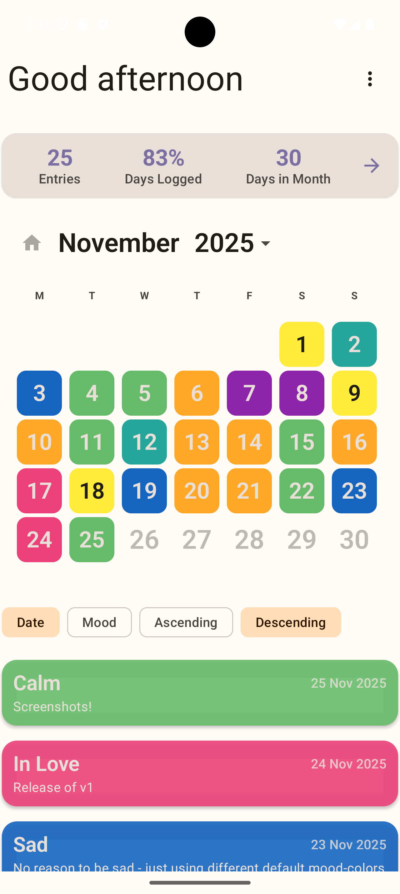
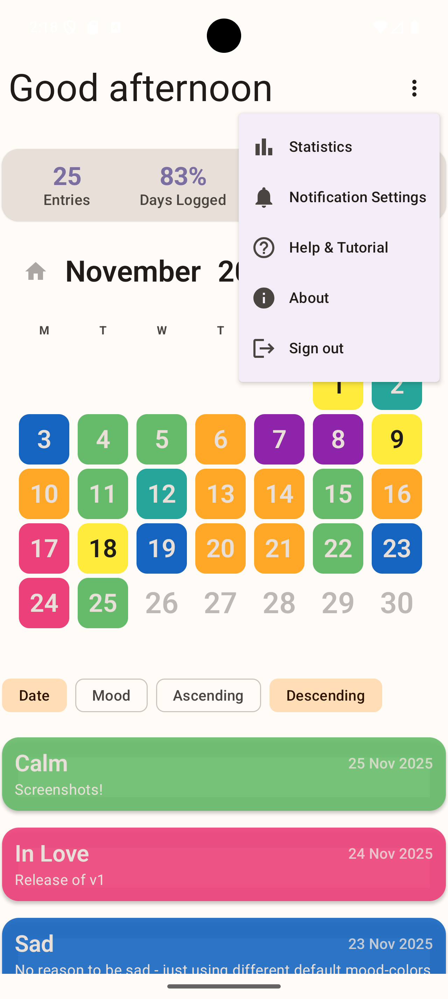
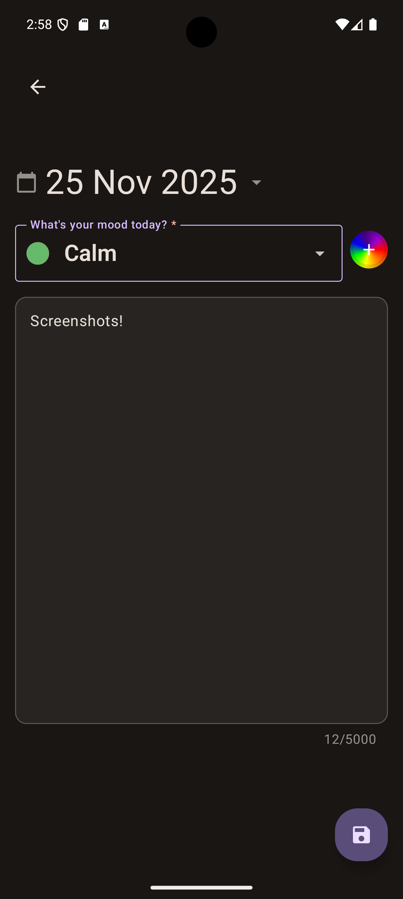
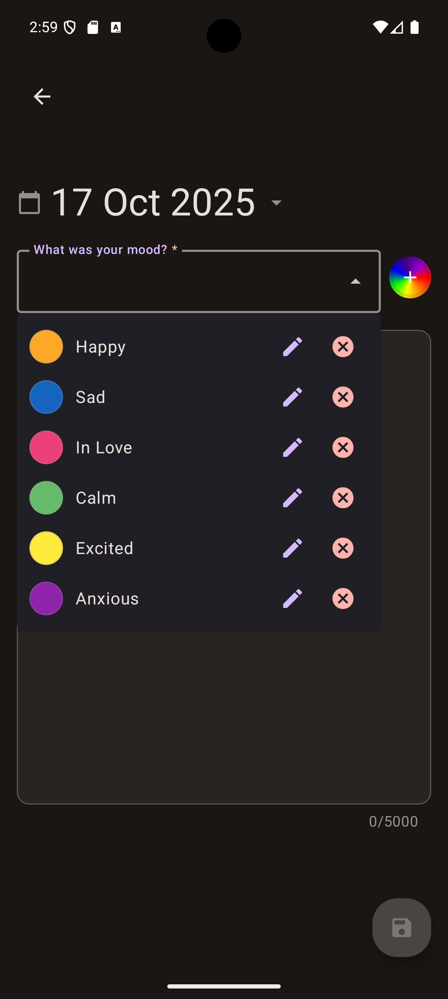
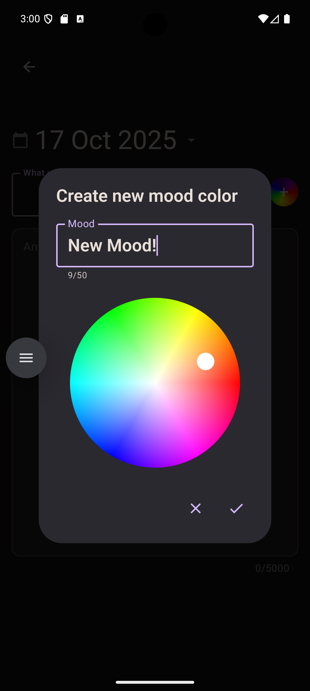
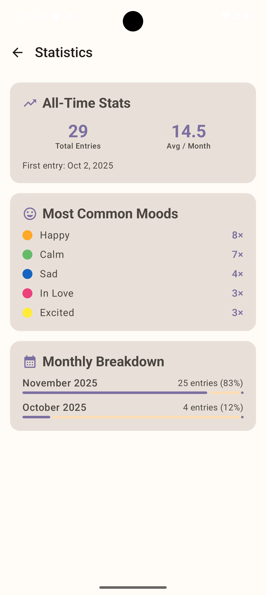
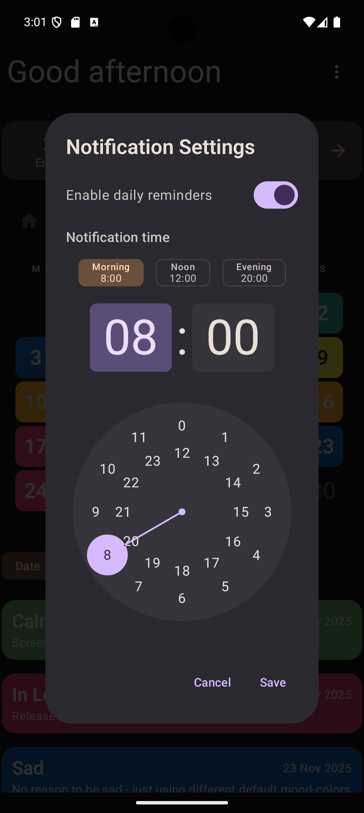
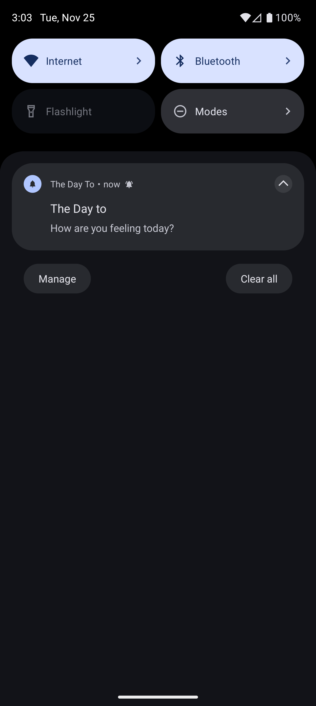
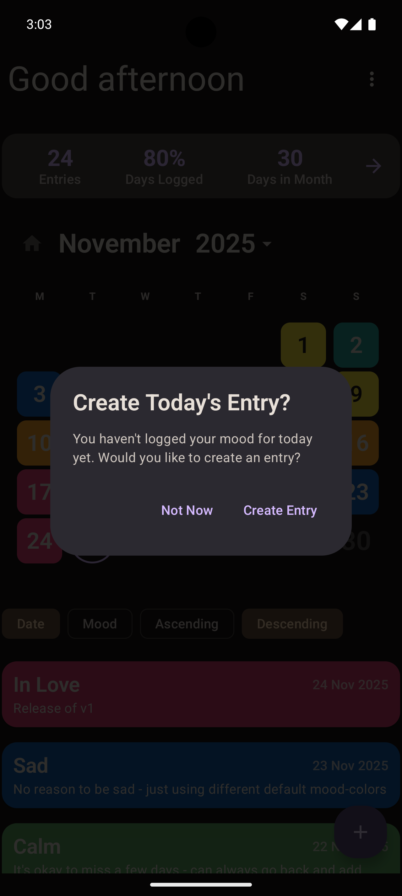

# The Day To

[](https://opensource.org/licenses/MIT)

Your personal daily mood journal for Android. Track your emotional wellbeing with colors, visualize your month at a glance, and gain insights into your patterns over time.

## Features

📅 **Daily Mood Tracking**
- Log one mood entry per day with optional notes
- Color-coded calendar view showing your month at a glance
- Swipe-to-delete entries with undo support
- Navigate between months with the date picker

🎨 **Custom Mood Colors**
- Create unlimited mood-color combinations
- Rainbow color wheel picker for precise color selection
- Edit or delete existing mood colors
- Visual color indicators throughout the app

📊 **Statistics & Insights**
- All-time stats: total entries, average per month, first entry date
- Most common moods with frequency counts
- Monthly breakdown showing entries and completion percentage

🔔 **Daily Reminders**
- Configurable notification time
- Quick presets: Morning (8:00), Noon (12:00), Evening (20:00)
- Smart reminder dialog when no entry exists for today
- Auto-dismiss when entry is created

🔒 **Privacy-First**
- All data stored locally on your device (Room database)
- No account or sign-in required — open the app and start journaling
- No cloud sync, no data collection, no tracking
- Your journal stays completely private

🔄 **In-App Updates**
- Automatic update checks on app launch
- Download and install updates directly from within the app
- Manual "Check for Updates" option in settings menu
- Dismiss updates you don't want to install

✨ **Modern UX**
- Material Design 3 with dynamic theming
- Light and dark mode support
- Smooth animations and haptic feedback
- Tutorial dialogs for first-time users
- WCAG-compliant touch targets (48dp minimum)

## Screenshots

### Calendar Overview
| Calendar | Menu |
|----------|------|
|  |  |

### Entry Editor
| Editor | New Entry | Color Picker |
|--------|-----------|--------------|
|  |  |  |

### Statistics
| Stats Overview |
|----------------|
|  |

### Notifications & Reminders
| Settings | Daily Reminder | Entry Prompt |
|----------|----------------|--------------|
|  |  |  |

## Tech Stack

| Category | Technology |
|----------|------------|
| **Language** | Kotlin 2.3.21 |
| **UI** | Jetpack Compose + Material 3 |
| **Architecture** | Clean Architecture (MVVM) |
| **Database** | Room 2.8.4 |
| **DI** | Koin 4.2.2 |
| **Background Work** | WorkManager 2.11.2 |
| **Auth** | None — fully local, no account required |
| **Navigation** | Jetpack Navigation Compose |
| **Logging** | Timber |

## Architecture

The app follows **Clean Architecture** with clear separation of concerns:

```
app/
├── auth/           # Authentication (sign-in/out)
├── journal/        # Core mood journaling feature
│   ├── data/       # Room entities, DAOs, repositories
│   ├── domain/     # Models, use cases, repository interfaces
│   └── ui/         # Screens, ViewModels, components
└── core/           # Shared utilities, theme, DI modules
```

**Key Patterns:**
- Unidirectional Data Flow (StateFlow + SharedFlow)
- Repository pattern with offline-first approach
- Use cases for business logic
- Root/Presenter pattern for Compose screens

## Quality

- **448 Tests** (400 unit + 48 instrumented)
- Repository integration tests with real Room database
- Turbine for Flow testing

## Requirements

- Android 8.1+ (API 27)

## Building

```bash
# Debug build
./gradlew assembleDebug

# Run tests
./gradlew test

# Full check (lint + tests)
./gradlew check
```

## Development

Two branches:

- **`local-only`** — the current **release branch** that ships to the Play Store (no sign-in / cloud sync).
- **`main`** — development branch with the full cloud-sync feature set (not shipped).

See [docs/overview.md](docs/overview.md) for architecture, the release flow, and the `CLOUD_SYNC_ENABLED` feature flag.

## Download

Get the latest APK from the [Releases](https://github.com/Zlurgg/The-Day-To/releases) page.

## License

This project is licensed under the MIT License - see the [LICENSE](LICENSE) file for details.

## Author

Created by [Zlurgg](https://github.com/Zlurgg)

---

*Track your moods, understand your patterns, own your data.* 🌈
